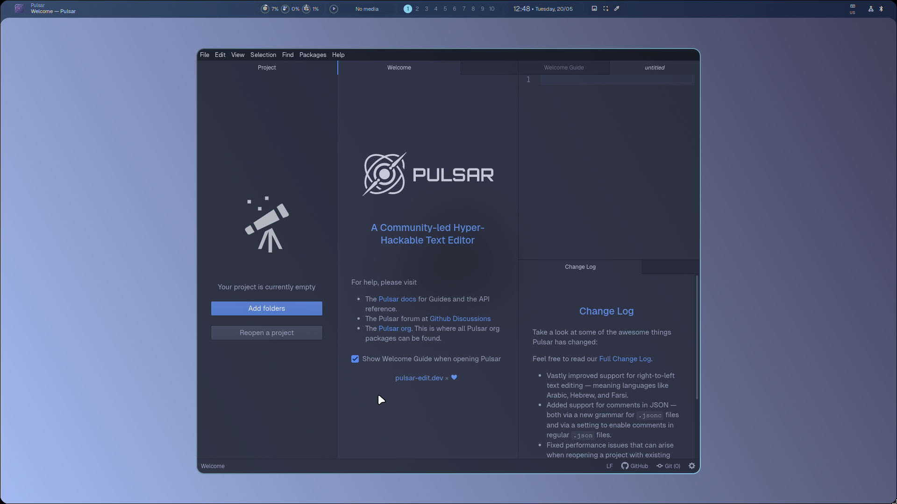

# MyHyprLuna

##  Introducción

MiHyprLuna es un fork personalizado de [HyprLuna](https://hyprluna.org), una configuración excepcional para Hyprland. Este fork mantiene la esencia y calidad visual de HyprLuna mientras introduce nuevos atajos de teclado, flujos de trabajo y configuraciones inspiradas en [hyDE](https://github.com/HyDE-Project/HyDE).

## 🔧 Modificaciones principales

| Categoría | Cambios realizados |
|-----------|-------------------|
| Atajos de teclado, acciones | Agregado un par de atajos y acciones de hyDE |
| Aplicaciones predeterminadas | Selección personalizada de aplicaciones alineadas con mi flujo de trabajo |
| Cheat sheet | Agregado cheats de tmux |

## 🙏 Agradecimientos

- A los creadores originales de [HyprLuna](https://hyprluna.org) por su increíble trabajo y base sólida
- Al proyecto [hyDE](https://github.com/HyDE-Project/HyDE) por la inspiración en varios aspectos de la configuración
- A la comunidad de Hyprland por su continuo desarrollo y soporte

**Nota:** Esta configuración está en constante evolución y mejora. Los cambios y configuraciones realizadas en este fork son en base a mis necesidades personales, cualquier cambio y sugerencias son bienvenidos a través de issues o pull requests.
